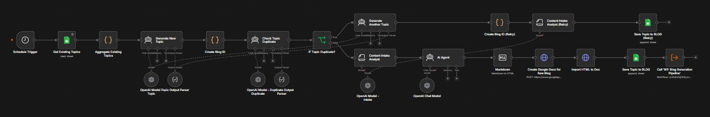
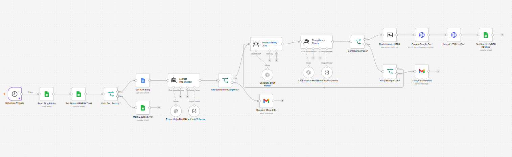
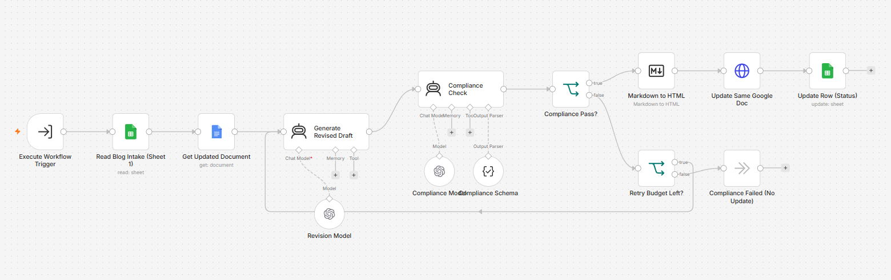
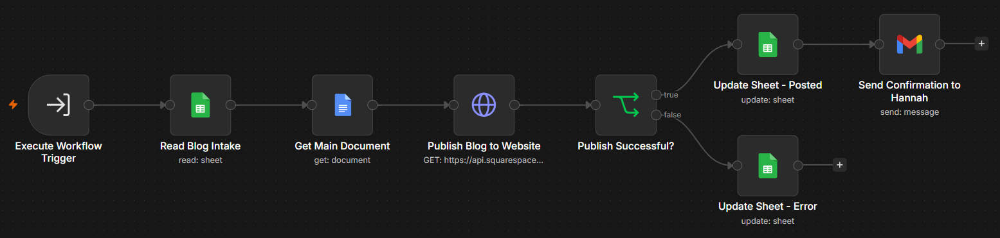

# Automated Content Generation & Publishing

An automated pipeline that operates as a digital content team. This system utilizes scheduled workflows to generate blog topics, draft content, route drafts for human-in-the-loop (HITL) approval via WhatsApp or Slack, execute revisions, and automatically publish to the web.

Instead of manually researching topics and writing posts, this system connects your intake databases, document editors, and website publishing APIs, executing your brand's content Standard Operating Procedures (SOPs) automatically.

## Automated Workflow Execution

The pipeline operates across multiple specialized, interconnected workflows. Upon execution, the automation checks existing content to avoid duplicates, passes context to LLMs for targeted drafting, runs structured compliance checks, and executes API calls to publish the content after human approval.

## Project Overview

This project demonstrates how brands can deploy advanced content automations using LLM APIs (e.g., OpenAI), workspace databases (Google Sheets/Docs), messaging platforms (WhatsApp/Slack), and website CMS APIs.

Each execution follows a structured, traceable process:
*   **Observe (Database):** The automation monitors existing topic sheets to ensure no duplicate content is generated.
*   **Process (LLM):** Using strict system prompts and compliance schemas, the automation evaluates the generated draft, extracts required information, and checks against brand guidelines.
*   **Validate (HITL):** Before publishing, the workflow pauses and routes the draft to a manager via WhatsApp or Slack for approval, ensuring zero unapproved external communications.
*   **Execute (Publish):** Upon receiving human approval, the automation converts the markup to HTML and schedules the post via the website API.

## Automation Capabilities

*   **Automated Topic Generation:** Checks for duplicates and generates fresh, relevant blog topics automatically.
*   **Draft & Compliance Checking:** Generates comprehensive blog drafts and passes them through an automated, schema-driven compliance check.
*   **Structured Revision:** Handles feedback loops by passing specific human input back to the LLM for draft revisions.
*   **Human-in-the-Loop (HITL) Safety:** Routes generated drafts to communication channels for manager approval before going live.
*   **State & Status Logging:** Updates Google Sheets at every step (Generating, Under Review, Approved, Needs Revision, Posted) to maintain an accurate system log.

## Pipeline Configuration & Workflows

### 1. Blog Topic Generator
Aggregates existing topics, checks for duplicates, and generates new blog IDs and content subjects to maintain a fresh pipeline.


### 2. Blog Generation Pipeline
Reads intake sheets, extracts information, generates a draft, and runs a strict compliance check before converting to a Google Doc.


### 3. Blog Approval and Revision (HITL)
Aggregates drafts under review, sends bulk reminders, and triggers WhatsApp/Slack messages for manager approval. Dynamically routes to the Publish or Revision workflow based on human response.
.prt3.png)

### 4. Blog Revision Workflow
Takes feedback from the approval stage, generates a revised draft using a specialized revision prompt, re-runs compliance checks, and updates the existing document.


### 5. Blog Publishing
Triggers on approval, fetches the final document, formats and publishes the blog to the website, and emails a final confirmation to the stakeholders.


## Tech Stack

| Component | Technology |
| --- | --- |
| **Automation Platform** | Workflow Automation Engine (e.g., Make/n8n) / Webhooks |
| **LLM API** | OpenAI |
| **Database / State** | Google Sheets & Google Docs |
| **Integrations** | WhatsApp/Slack, Gmail, Squarespace/CMS APIs |

## Repository Structure

```text
.github/
    workflows/             # CI/CD pipelines
src/
    prompts/               # System prompts for generation, revision, and compliance
    schemas/               # JSON schemas for output parsing
assets/
    blog-topic-generator.prt1.png
    blog-generation-pipeline.prt2.png
    blog-approval-and-revision(whatsapp or slack).prt3.png
    blog-revision-workflow.prt4.png
    blog-publishing.prt5.png
docs/
    architecture.md        # System design
    setup-guide.md         # Instructions to run the workflows
.gitignore
LICENSE
README.md
